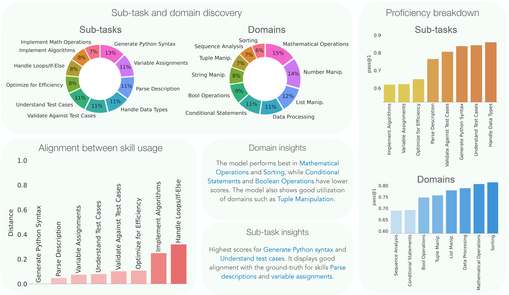
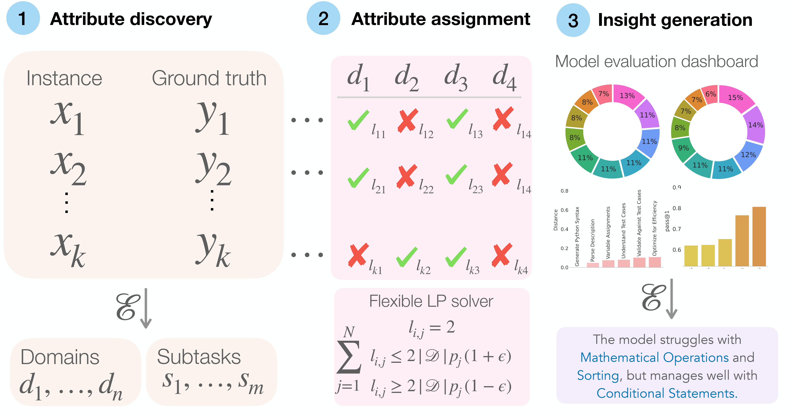

# QualEval: LLM data scientist 

**[QualEval: Qualitative Evaluation for Model Improvement](https://vishvakmurahari.com/QualEval/)**  
[Vishvak Murahari*](https://vishvakmurahari.com/), [Ameet Deshpande*](https://ameet-1997.github.io/), [Peter Clark](https://allenai.org/team/peterc), [Tanmay Rajpurohit](http://tanmay.one/), [Ashish Sabharwal](https://allenai.org/team/ashishs), [Karthik Narasimhan](https://www.cs.princeton.edu/~karthikn/), [Ashwin Kalyan](http://ashwinkalyan.com/)

### Installation
1. Create a conda environment: `conda create -n qualeval python=3.9`
2. `conda activate qualeval`
3. `pip install -r requirements.txt`
4. `touch .env`
5.  Add your OpenAI key in the `.env` file

### Process data:

MBPP: `python process_data.py --task_name mbpp --output_dir data/`

DialogSum: `python process_data.py --task_name knkarthick/dialogsum  --output_dir data/`

MMLU (Clinical Biology split): `python process_data.py --task_name mmlu_biology --output_dir data/ `

**For other datasets, follow the steps under the [QualEval on custom datasets](#qualeval-on-custom-dataset) section**

### Model generations

To generate outputs under different models for the above tasks, run scripts in `get_model_outputs_scripts/`

### Attribute discovery 

We then discover generate task categories such as sub-tasks and domains and goals from the evaluation data. 

Run scripts in `generate_categories_scripts/` to generate categories for the given tasks.

### Attribute scoring and assignment

To generate attribute assignments, we need to generate affinity scores for all attributes for both the ground truth (GT) output and the model generation.

To generate scores for the GT outputs, run scripts in `score_gt_scripts/`

To generate scores for the model outputs, run scripts in `score_model_outputs_scripts/`

### Dashboard generation

To generate the entire dashboard, please refer to scripts under `get_dashboard_scripts/`

The script generates `reportcard.pdf`, which has the entire dashboard, and also generates `reportcard.zip`, which consists of both data and image files containing parts of the dashboard. 

### QualEval on custom dataset
Running QualEval on your favorite custom dataset is simple. Follow the steps below:
1. Add custom data-processing logic in `process_data.py`
2. Add your custom task instruction, scoring prompts etc under `utils/templates.py`. QualEval is robust to different prompts, so feel free to make small edits to the existing prompts for your task.
3. Implement your custom proficiency metric in `utils/proficiency_scores.py`.